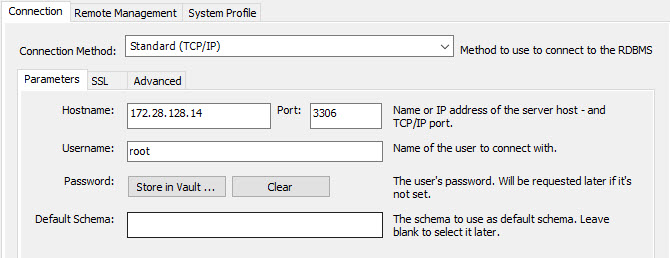

# mysql-8-vagrant

mysql-vagrant is a quick way to run mysql 8 locally for development without an ssh tunnel

### Vagrantfile variables
``MYSQL_IP # Define private IP``
``MYSQL_MEMORY_MB # Define VM Memory RAM``

### Start server

     $ vagrant up

### Connect to mysql:

- host: 172.28.128.14
- username: root
- password: root

MYSQL_IP = "172.28.128.14"

### From MySQL Workbench 8.0 CE

### Warning

For development use only, do not use in production.
Also, make sure your mysql port (3306) is not open on your computer for a local network or in general.

### License

MIT
